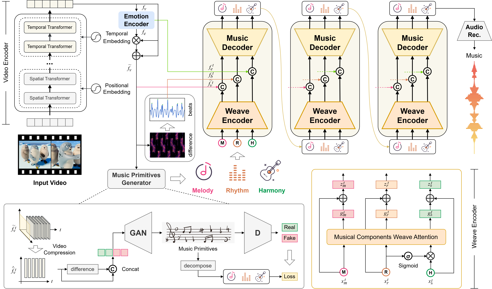

# WeaveV2M: Video-to-Music Generation via Structurally Decoupled Representation and Controllable Interweaving

## Abstract
<p style="text-align: justify">In video production, pleasant music that enhances the atmosphere is indispensable. However, generating music that aligns 
with complex video narrative rhythms remains a pressing challenge. Existing methods often lack long-range musical structure 
planning, leading to loosely aligned music or globally inconsistent melodies. Moreover, music inherently exhibits multi-faceted 
structures, while current methods typically adopt holistic modeling strategies, making it difficult for models to capture the 
hierarchical structure of music. To address these issues, we propose a video-to-music generation method 
based on structurally decoupled representations and controllable interweaving. The proposed approach innovatively decouples key
musical structural elements for modeling, enabling fine-grained mappings between video semantics and different musical attributes.
To ensure global–local coherence in long-range musical structures, we design a coarse-to-fine generation mechanism based on musical
primitives. In the first stage, the model focuses on understanding the thematic relationship between the video and music, 
generating structured musical primitives that establish the global tonal foundation. In contrast, the second stage performs 
parallel interweaving generation of decoupled representations under the guidance of musical primitives and fine-grained rules, 
producing precisely aligned structured musical sequences. Our method achieves a balance between 
global–local rhythmic synchronization and musical expressiveness in long video music sequence generation. Extensive experiments
demonstrate the effectiveness of the proposed approach. This work demonstrates that decoupled 
structural modeling combined with coarse-to-fine generation significantly improves the controllability of music generation, 
offering a promising direction for video-to-music generation.</p>

</img>

## Datasets
HarmonySet: https://huggingface.co/datasets/Zzitang/HarmonySet/tree/main

isophonics: https://isophonics.net/content/metric-modulations-dataset

MedleyDB: https://medleydb.weebly.com/downloads.html

BGM909: https://drive.google.com/drive/folders/1zRNROuTxVNhJfqeyqRzPoIY60z5zLaHK

POP909: https://drive.google.com/file/d/1YzwyE_Ch0dKDhJxC8X1irvYOOatB8KNq/view?usp=drive_link

V2M: https://huggingface.co/datasets/HKUSTAudio/VidMuse-V2M-Dataset

<p style="text-align: justify">HarmonySet is a dataset designed for video-music understanding tasks, containing 48,328 pairs of diverse video-music samples 
spanning multiple categories such as daily life, art, travel, sports, and technology. Each pair of samples is annotated in fine
detail across four dimensions: rhythm and synchronization, theme consistency, emotion, and culture. It also provides key timestamps 
to capture synchronous changes in music and visual transitions. We use this dataset as the primary training set for our model
and follow the official dataset split for model evaluation. Chord annotations are sourced from the Isophonics dataset, 
which contains recordings by popular artists such as The Beatles, Queen, Carole King, and Zweieck, along with precise 
structural annotations including chords, beats, and phrase structures. Pitch annotations are sourced from MedleyDB, a multi-track
music dataset comprising professionally produced recordings spanning various music genres, where each song is decomposed into 
multiple instrument tracks with precise temporal alignment. Importantly, MedleyDB provides frame-level annotations for melodies 
and pitch contours, enabling supervised learning of melodic structures from complex polyphonic audio. The dataset used for model 
performance evaluation also includes V2M \cite{18}, which comprises 300 video-music pairs with a total duration of 9 hours,
covering video types such as movie trailers, commercials, documentaries, and vlogs. The BGM909 test set comprises 909 video-music 
pairs, extended from the POP909 piano music dataset. Each video is the official music video for the corresponding track,
ensuring semantic consistency and temporal alignment. It provides high-quality MIDI files and detailed musical annotations
(chords, beats, key signatures, melody tracks, etc.), while also incorporating visual semantic information such as shot-cut 
detection and fine-grained textual descriptions.</p>

```shell
  mkdir meganwei/syntheory
  # Place the audio and video files from the downloaded HarmonySet dataset in this directory
```

## Installation

```bash
cd WeaveV2M

# Install in development mode
pip install -e .
```

### Requirements

- Python >= 3.10
- Transformers
- librosa==0.5.1
- matplotlib==1.5.3
- numpy==1.11.3
- pandas==0.18.1
- pandas-datareader==0.2.1
- pandasql==0.7.3
- pydub==0.19.0
- scikit-learn==0.17.1
- scipy==0.19.0
- seaborn==0.7.1
- soundcloud==0.5.0
- tensorflow==1.1.0
- torch==0.1.12.post2
- torchvision==0.1.8
- See `requirements.txt` for full list


### GAN implementation to generate music primitives.

```bash
    cd /WeaveV2M/GAN
    pip install -e .
```

GAN Organization
------------

    ├── Makefile           <- Makefile with commands like `make data` or `make train`
    ├── README.md          <- The top-level README for developers using this project.
    ├── data
    │   ├── external       <- Data from third party sources.
    │   ├── interim        <- Intermediate data that has been transformed.
    │   ├── processed      <- The final, canonical data sets for modeling.
    │   └── raw            <- The original, immutable data dump.
    │
    ├── docs               <- A default Sphinx project; see sphinx-doc.org for details
    │
    ├── models             <- Trained and serialized models, model predictions, or model summaries
    │
    ├── notebooks          <- Jupyter notebooks. Naming convention is a number (for ordering),
    │                         the creator's initials, and a short `-` delimited description, e.g.
    │                         `1.0-jqp-initial-data-exploration`.
    │
    ├── references         <- Data dictionaries, manuals, and all other explanatory materials.
    │
    ├── reports            <- Generated analysis as HTML, PDF, LaTeX, etc.
    │   └── figures        <- Generated graphics and figures to be used in reporting
    │
    ├── requirements.txt   <- The requirements file for reproducing the analysis environment, e.g.
    │                         generated with `pip freeze > requirements.txt`
    │
    ├── src                <- Source code for use in this project.
    │   ├── __init__.py    <- Makes src a Python module
    │   │
    │   ├── data           <- Scripts to download or generate data
    │   │   └── make_dataset.py
    │   │
    │   ├── features       <- Scripts to turn raw data into features for modeling
    │   │   └── build_features.py
    │   │
    │   ├── models         <- Scripts to train models and then use trained models to make
    │   │   │                 predictions
    │   │   ├── predict_model.py
    │   │   └── train_model.py
    │   │
    │   └── visualization  <- Scripts to create exploratory and results oriented visualizations
    │       └── visualize.py
    │
    └── tox.ini            <- tox file with settings for running tox; see tox.testrun.org


## Quick Start

Run the examples in order:

### 1. Train a Control Direction

```bash
python 01_train_note_direction.py
python 01_train_interval_direction.py
```

### 2. Generate Controlled Music

Use the trained direction to generate music:

```bash
python 02_generate_controlled.py
```

**Features/hyperparams available for reducing audio artifacts or changing generation:**
- **Layer pruning**: Choose which layers to control (all, top-k, exponential dropout)
- **Time-varying control**: Apply exponential/linear decay over time
- **Probabilistic injection**: Control probability at each generation step
- **Custom coefficients**: Use different control strengths for regression vs classification

Edit the configuration section in the file to customize:
```python
LAYER_SELECTION = "all"  # Options: "all", "top_k", "exp_weighting"
TIME_CONTROL = None      # Options: None, "exp_decay", "linear_decay"
INJECT_CHANCE = 1.0      # Range: 0.0 to 1.0
```

### 3. Temporal Control

Apply time-varying control during generation:

```bash
python 03_temporal_control.py
```
Functions included:
- Constant control (baseline)
- Exponentially decaying control
- Linearly increasing control


### 4. Multi-Direction Control (Optional)

Control multiple concepts simultaneously:

```bash
python 04_multidirection_control.py
```

### 5. Train with Regression Direction (Optional)

```bash
# Train the tempo direction
python 05_regression_direction.py train
```

### 6. Video to Music Generation
```shell
# Generate music with tempo control
python 05_regression_direction.py generate --video "example.mp4"

# Or run both sequentially (default)
python 05_regression_direction.py
```

## Advanced Generation Options explained
### Layer Pruning Methods

**All Layers (default)**
```python
LAYER_SELECTION = "all"
```
- Controls all 47 decoder layers equally
- Best for maximum control strength
- Use when you want the strongest effect

**Top-K Selection**
```python
LAYER_SELECTION = "top_k"
TOP_K = 16
```
- Selects the k best-performing layers based on training results

**Exponential Dropout**
```python
LAYER_SELECTION = "exp_dropout"
EXP_BASE_WEIGHT = 1.0
EXP_DECAY_RATE = 0.95
```
- Uses all layers but with performance-weighted contributions

### Time-Varying Control

**Constant (default)**
```python
TIME_CONTROL = None
```
- Control coefficient stays constant throughout generation

**Exponential Decay**
```python
TIME_CONTROL = "exp_decay"
TIME_DECAY_RATE = 0.998
```
- Control gradually decreases over time
- Useful for smooth transitions
- Lower decay_rate = faster decay

**Linear Decay**
```python
TIME_CONTROL = "linear_decay"
```
- Control decreases linearly over 1500 steps
- Predictable, uniform decrease

### Probabilistic Injection

```python
INJECT_CHANCE = 0.3  # 30% probability
```
- Controls the probability of applying the direction at each generation step
- `1.0` = always apply (deterministic)
- `0.3` = apply 30% of the time (stochastic)
- Lower values = subtler, more natural control, prevents oversteering


## License

This code is released under the CC0 1.0 Universal (Public Domain) license.
You may use, modify, and distribute it without restriction.

## Citation
```
@InProceedings{Zhou,
    author    = {Zhou, Zitang and Mei, Ke and Lu, Yu and Wang, Tianyi and Rao, Fengyun},
    title     = {HarmonySet: A Comprehensive Dataset for Understanding Video-Music Semantic Alignment and Temporal Synchronization},
    booktitle = {Proceedings of the IEEE/CVF Conference on Computer Vision and Pattern Recognition (CVPR)},
    month     = {June},
    year      = {2025},
    pages     = {3152-3162}
}

@inproceedings{Medleydb,
  title={Medleydb: A multitrack dataset for annotation-intensive mir research.},
  author={Bittner, Rachel M and Salamon, Justin and Tierney, Mike and Mauch, Matthias and Cannam, Chris and Bello, Juan Pablo},
  booktitle={Ismir},
  volume={14},
  pages={155--160},
  year={2014}
}

@InProceedings{Tian,
    author    = {Tian, Zeyue and Liu, Zhaoyang and Yuan, Ruibin and Pan, Jiahao and Liu, Qifeng and Tan, Xu and Chen, Qifeng and Xue, Wei and Guo, Yike},
    title     = {VidMuse: A Simple Video-to-Music Generation Framework with Long-Short-Term Modeling},
    booktitle = {Proceedings of the IEEE/CVF Conference on Computer Vision and Pattern Recognition (CVPR)},
    month     = {June},
    year      = {2025},
    pages     = {18782-18793}
}

@InProceedings{Li,
    author    = {Li, Sizhe and Qin, Yiming and Zheng, Minghang and Jin, Xin and Liu, Yang},
    title     = {Diff-BGM: A Diffusion Model for Video Background Music Generation},
    booktitle = {Proceedings of the IEEE/CVF Conference on Computer Vision and Pattern Recognition (CVPR)},
    month     = {June},
    year      = {2024},
    pages     = {27348-27357}
}
```
